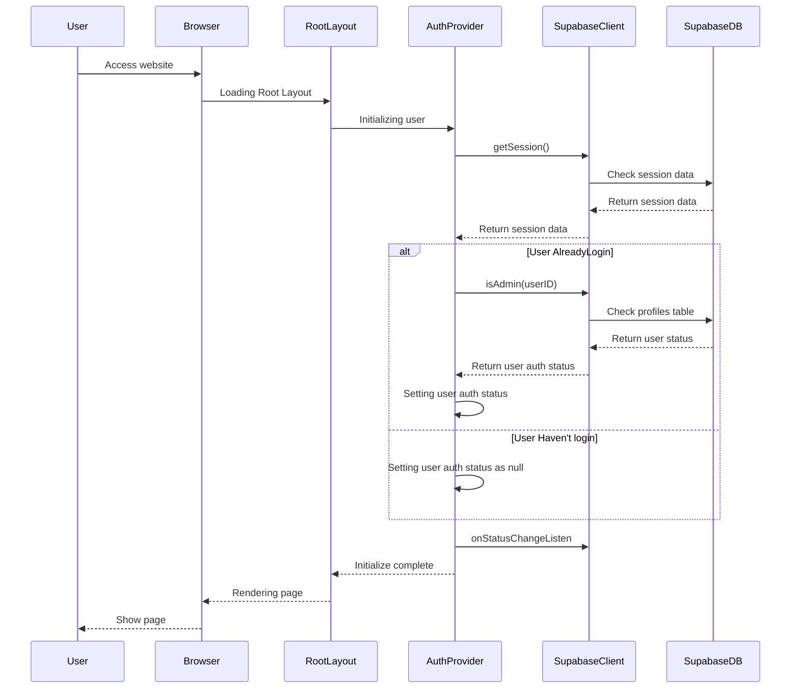

## Process of access website

### access-initialize sequence diagram

```mermaid
sequenceDiagram
    participant User as User
    participant Browser as Browser
    participant RootLayout as RootLayout
    participant AuthProvider as AuthProvider
    participant Supabase as SupabaseClient
    participant SupabaseDB as SupabaseDB

    User->>Browser: Access website
    Browser->>RootLayout: Loading Root Layout
    RootLayout->>AuthProvider: Initializing user

    AuthProvider->>Supabase: getSession()
    Supabase->>SupabaseDB: Check session data
    SupabaseDB-->>Supabase: Return session data
    Supabase-->>AuthProvider: Return session data

    alt User AlreadyLogin
        AuthProvider->>Supabase: isAdmin(userID)
        Supabase->>SupabaseDB: Check profiles table
        SupabaseDB-->>Supabase: Return user status
        Supabase-->>AuthProvider: Return user auth status
        AuthProvider->>AuthProvider: Setting user auth status
    else User Haven't login
        AuthProvider->>AuthProvider: Setting user auth status as null
    end

    AuthProvider->>Supabase: onStatusChangeListen
    AuthProvider-->>RootLayout: Initialize complete
    RootLayout-->>Browser: Rendering page
    Browser-->>User: Show page
```

